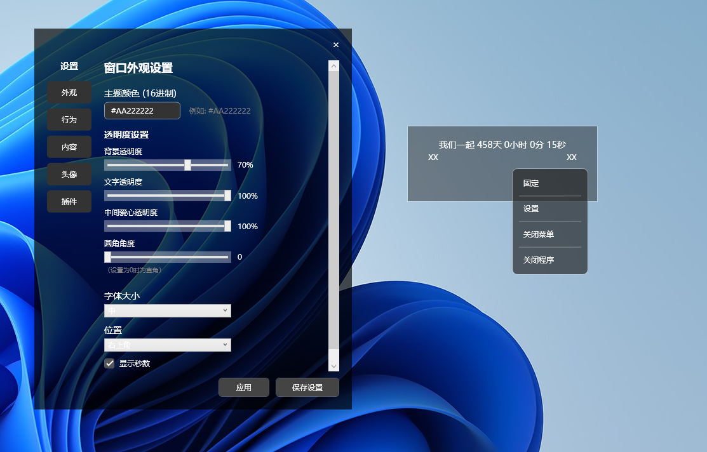

# 桌面小挂件 ❤️

一个基于 **.NET 10 + WPF** 的 Windows 桌面倒计时挂件，专为情侣设计，可始终显示在桌面最前，记录从指定日期起经过的时间。

## 截图




## 功能特性

- **倒计时显示** — 自定义起始时间，实时显示已过 `X天 X小时 X分 X秒`
- **双头像系统** — 左右各显示一个头像（支持本地图片或 URL），可自定义名称
- **居中爱心** — 头像中间显示爱心装饰图
- **始终置顶** — 窗口悬浮于所有应用之上，不占用任务栏
- **拖拽移动 / 固定** — 右键菜单切换「固定/取消固定」，固定后不可拖动
- **丰富的自定义设置**
  - **外观** — 主题色、背景/文字/爱心透明度、圆角、字体大小、屏幕位置
  - **行为** — 是否显示在任务栏、开机自启、窗口置顶
  - **内容** — 自定义文字标签、起始日期时间
  - **头像** — 左右头像图片、名称、透明度，支持本地文件或 URL
- **插件系统** — 支持通过 `dllmod/` 目录加载 DLL 扩展（预留功能）
- **设置持久化** — 配置自动保存至 `%APPDATA%\DesktopWidget\settings.json`

## 环境要求

- [.NET 10.0 SDK](https://dotnet.microsoft.com/download/dotnet/10.0) 或更高版本
- Windows 10 / Windows 11

## 快速开始

```bash
# 克隆仓库
git clone https://github.com/yourusername/DesktopWidget.git
cd DesktopWidget

# 还原依赖
dotnet restore

# 构建
dotnet build

# 运行
dotnet run

# 发布为单文件可执行程序
dotnet publish -c Release -r win-x64 --self-contained true \
  -p:PublishSingleFile=true \
  -p:IncludeNativeLibrariesForSelfExtract=true \
  -p:PublishTrimmed=false
```

发布后的程序位于 `bin/Release/net10.0-windows/win-x64/publish/`。

## 项目结构

```
DesktopWidget/
├── App.xaml / App.xaml.cs         # 应用程序入口
├── MainWindow.xaml / .cs          # 主窗口（挂件界面）
├── SettingsWindow.xaml / .cs      # 设置窗口
├── AppSettings.cs                 # 配置模型与序列化
├── DesktopWidget.csproj           # 项目文件
├── dllmod/                        # 插件目录（运行时）
└── .github/workflows/build.yml    # GitHub Actions CI
```

## 操作说明

| 操作 | 方式 |
|------|------|
| 移动窗口 | 未固定时直接拖拽 |
| 右键菜单 | 在窗口任意位置右键 |
| 固定/取消固定 | 右键菜单 → 取消固定/固定 |
| 打开设置 | 右键菜单 → 设置 |
| 关闭程序 | 右键菜单 → 关闭程序 |

## 插件开发（预留功能）

将实现了约定接口的 DLL 放入 `dllmod/` 目录，即可在设置界面的「插件」面板中管理。

## 技术栈

- **语言**: C# (Nullable enabled)
- **框架**: .NET 10.0-windows
- **UI**: WPF (XAML)
- **序列化**: System.Text.Json

## 许可

MIT License
